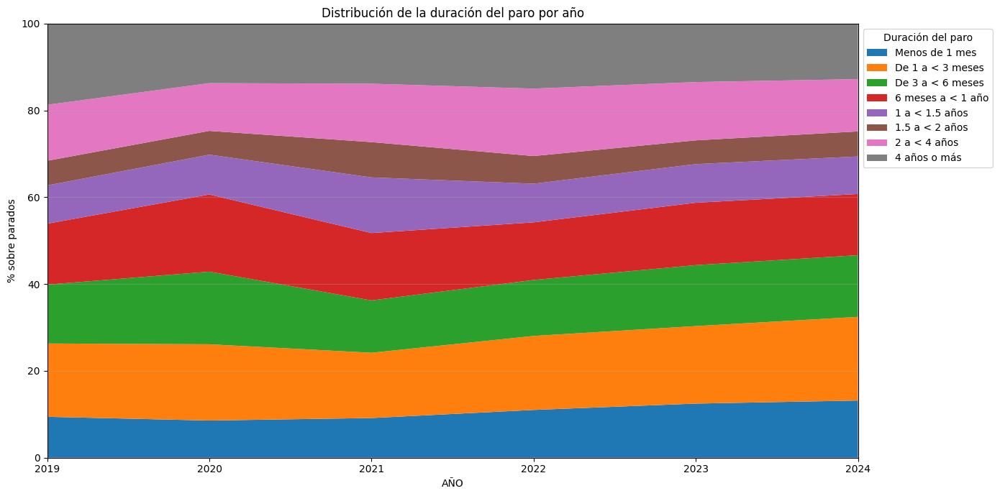
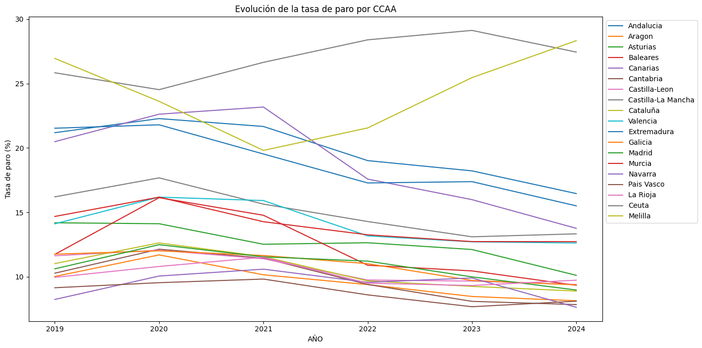
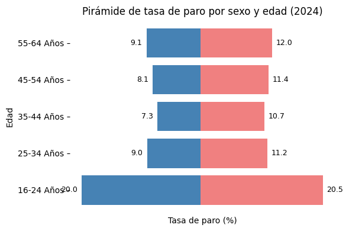
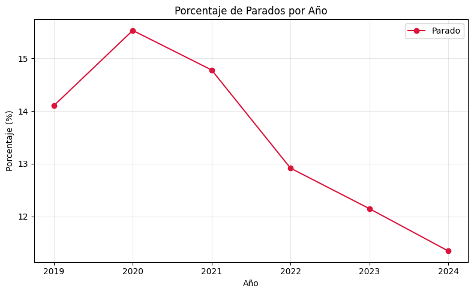
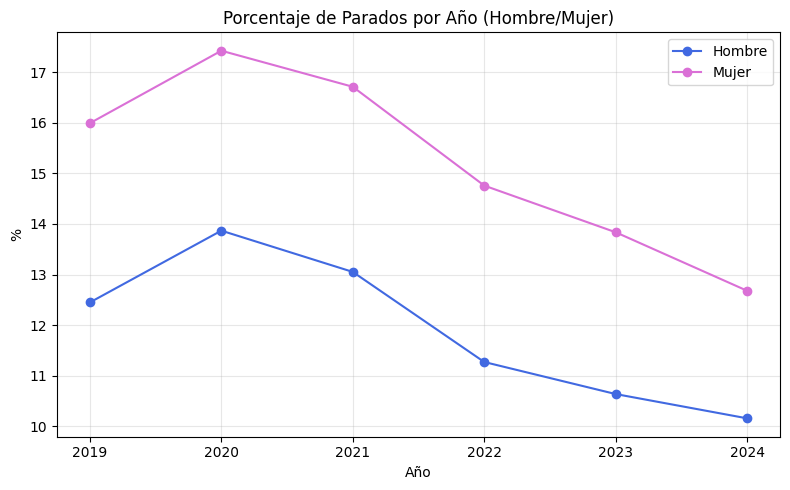
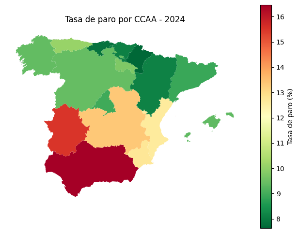
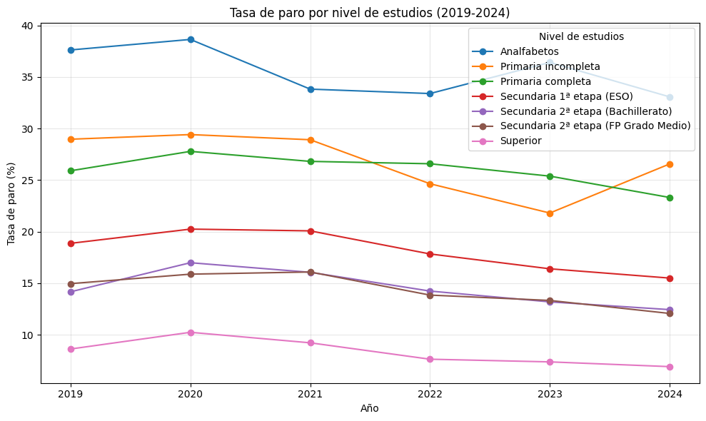

# Análisis del Paro en España — EPA 2019–2024
 
Análisis exploratorio del desempleo en España usando los microdatos de la **Encuesta de Población Activa (EPA)** del INE. El proyecto cubre el periodo 2019–2024 (todos los trimestres) e incluye el impacto del COVID-19 en el mercado laboral español.
 
---
 
## Preguntas de investigación
 
- ¿Sigue siendo el sexo masculino el predominante en el sector laboral?
- ¿Son los jóvenes realmente el grupo más afectado por el paro?
- ¿Cómo afectó el COVID-19 a las distintas comunidades autónomas?
- ¿Protege el nivel educativo frente al desempleo?
- ¿Cuáles son los grupos más y menos vulnerables durante la crisis?
 
---
 
## Hallazgos clave
 
| Indicador | Valor |
|---|---|
| Tasa de paro media nacional (2024) | 11.3% |
| Tasa de paro juvenil (16–24 años, 2024) | 20.0% |
| Comunidad con más paro (2024) | Melilla — 28.33% |
| Comunidad con menos paro (2024) | Navarra — 7.63% |
| Grupo más afectado por COVID-19 | Hombres 16–24 años de Melilla (58.03%) |
| Reducción del paro de larga duración (+4 años) | De 19.17% (2019) a 12.73% (2024) |
 
Otros hallazgos destacados:
- La tasa de paro bajó del **14.1% (2019) al 11.3% (2024)**, a pesar del pico de la pandemia.
- Las mujeres tuvieron una mayor brecha de paro durante el COVID-19 (+3.66 puntos respecto a hombres).
- Los encuestados con estudios superiores mantienen una tasa de paro estable en torno al **7%**, frente al **25–40%** de quienes no completaron la primaria.
- El sur dela peninsula padece el paro más alto: Andalucía (16.46%) y Extremadura (15.51%).
 
---
 
## Estructura del proyecto

 ```

📁 epa-paro-espana/
├── 📓 analisis_paro_EPA_2019_2024.ipynb   # Notebook principal con el análisis completo
├── 📄 README.md
├── 📁 Screenshots
└── 📁 data/
    ├── EPA_2019T1.csv
    ├── EPA_2019T2.csv
    └── ...
 
>   Los archivos de datos **no están incluidos** en el repositorio por su tamaño. Ver instrucciones de descarga abajo.

```

---
 
## Descarga de datos
 
Los microdatos de la EPA están disponibles en la web del INE:
 
1. Entra en [https://www.ine.es/dyngs/INEbase/es/operacion.htm?c=Estadistica_C&cid=1254736176918&menu=resultados&idp=1254735976595](https://www.ine.es/dyngs/INEbase/es/operacion.htm?c=Estadistica_C&cid=1254736176918&menu=resultados&idp=1254735976595)
2. Descarga los **microdatos** de cada trimestre (T1–T4) para los años 2019–2024
3. Coloca los archivos en la carpeta `data/` con el formato `EPA_YYYYTT.csv` o `EPA_YYYYTT.tab`
 
---
 
## Instalación y ejecución
 
### Requisitos
 
- Python 3.9 o superior
- Jupyter Notebook o JupyterLab
 
### Pasos

 ```bash

# 1. Clona el repositorio
git clone https://github.com/boperdose/epa-paro-espana.git
cd epa-paro-espana
 
# 2. Instala las dependencias
pip install pandas numpy matplotlib seaborn geopandas
 
# 3. Descarga los datos del INE y colócalos en data/
 
# 4. Abre el notebook
jupyter notebook analisis_paro_EPA_2019_2024.ipynb

```

### Dependencias principales
 
| Librería | Uso |
|---|---|
| `pandas` | Carga, limpieza y transformación de datos |
| `numpy` | Operaciones numéricas |
| `matplotlib` | Visualizaciones |
| `seaborn` | Estilos de gráficos |
| `geopandas` | Mapa de calor por CCAA |
 
---
 
## Visualizaciones incluidas
 
| Visualización | Descripción |
|---|---|
|  | Distribución de la duración del desempleo por año |
|  | Evolución de la tasa de paro por Comunidad Autónoma |
|  | Tasa de paro por sexo y franja de edad (2024) |
|  | Fluctuación del paro 2019–2024 |
|  | Evolución del paro por sexo (2019–2024) |
|  | Mapa coroplético de la tasa de paro por CCAA (2024) |
|  | Tasa de paro por nivel educativo (2019–2024) |
## Fuente de datos
 
**Instituto Nacional de Estadística (INE)** — Encuesta de Población Activa  
[https://www.ine.es/dyngs/INEbase/es/operacion.htm?c=Estadistica_C&cid=1254736176918](https://www.ine.es/dyngs/INEbase/es/operacion.htm?c=Estadistica_C&cid=1254736176918)
 
- Cobertura: 2019 T1 — 2024 T4
- Ponderación: variable `FACTOREL` (factor de elevación muestral)
 
---
 
## Autor
 
Eloy Jalloul Xicart, 
Estudiante de Matemáticas  
[eljallxi12@gmail.com]
